# GoodJob


[](https://github.com/rubywu0604/GoodJob/actions)


GoodJob is a platform that analyzes job market trends of engineering, offering visualized statistical reports. Futhermore, It serves for engineers seeking job opportunities, assisting them in securing an ideal good job.

- [Website](https://www.get-good-job.com)
- [Video introduction](https://drive.google.com/file/d/1bH5sI9850xf-Kc5xNKoD5UrVQQ5g55DD/view)

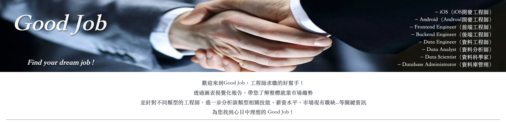

## Table of Contents
- [GoodJob](#goodjob)
  - [Table of Contents](#table-of-contents)
  - [Architecture](#architecture)
  - [Features](#features)
    - [Job API](#job-api)
    - [Website](#website)
    - [Data Pipeline](#data-pipeline)
    - [Database/Storage](#databasestorage)
    - [Visualization](#visualization)
    - [Scheduling](#scheduling)
    - [Monitoring](#monitoring)
    - [CI/CD](#cicd)
  - [Technologies Used](#technologies-used)
  - [Contact](#contact)
  
## Architecture

__Overall Architecture__
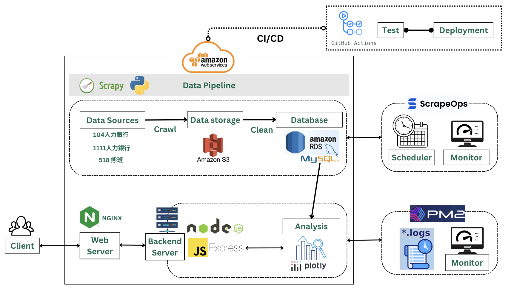

__Overview__
- **Server A**: Configured as a Scrapy pipeline, it uses ETLT techniques to process data scraped from various websites. All the scraped data is stored in an Amazon S3 bucket during the initial transformation phase. After normalization, the data is finally saved into a MySQL database.

- **Server B**: Designed to handle frontend website layout, it efficiently manages a high volume of client requests using a Node.js environment. The server is interconnected with the same database utilized by Server A, enabling it to access the database tables and retrieve the required data as responses to client requests.

- **Monitor**: Oversaw data pipeline and server to log errors. Ensured uninterrupted 100% data pipeline completion during scraping using ScrapeOps. Continuously checked frontend website status by PM2 and auto-sent email notifications if server appears any issues.

- **DevOps**: Utilized GitHub Actions for Continuous Integration (CI) and Continuous Deployment (CD) to verify error-free code passing unit tests. Upon successful test completion, it triggered the next deployment job to initiate the deployment to an AWS EC2 server.

_[Top](#table-of-contents)_

## Features

### Job API

- **Protocol:** `https`

- **Host Name:** `www.get-good-job.com`

- **End Point:** 
  
  `/api/jobs` for All jobs  
  `/api/jobs/ios_engineer` for iOS Engineer jobs  
  `/api/jobs/android_engineer` for Android Engineer jobs  
  `/api/jobs/frontend_engineer` for Frontend Engineer jobs  
  `/api/jobs/backend_engineer` for Backend Engineer jobs  
  `/api/jobs/data_engineer` for Data Engineer jobs  
  `/api/jobs/data_analyst` for Data Analysis jobs  
  `/api/jobs/data_scientist` for Data Scientist jobs  
  `/api/jobs/dba` for Database Administrator jobs  

- **Method:** `GET`

_[Top](#table-of-contents)_

### Website
GoodJob website is a Node.js application using Express.js to create a web server that serves HTML pages and provides API endpoints for accessing job listings stored in a MySQL database.

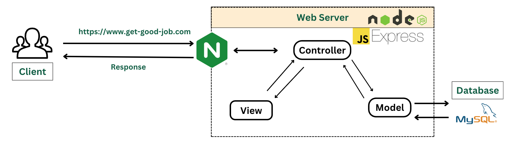

- **MVC Structure**
  - **Models**:
  
    Data models in the MVC architecture are responsible for managing the data logic. In the context of the GoodJob website, data models represent the structure and organization of the database, including tables and fields.

  - **Views**:
  
    The views in the MVC architecture are responsible for presenting the data to the user. In GoodJob project, views are represented by HTML templates written in **EJS** (Embedded JavaScript) format. These templates define the structure of the web pages that users interact with. The specific EJS views used for rendering pages are not mentioned in this section.

  - **Controllers**: 
  
    Defines controller functions for handling different routes. Each controller function communicates with the database to perform queries and send formatted responses.
  
    - `getpage`: Renders the HTML page for the root route.
    - `getAll`: Retrieves all job listings from the database and sends them as JSON.
    - `get`: Retrieves job listings based on a specific category and sends them as JSON.

- **Using Nginx to serve HTTPS**

  Nginx is configured to serve the domain name `get-good-job.com` over HTTPS, and it acts as a reverse proxy, directing incoming requests from `https://get-good-job.com` on port 443 (HTTPS) to a Node.js application running on `localhost:8080`. This setup ensures that all requests to the domain are handled securely via HTTPS, and they are forwarded to Node.js application for processing.

_[Top](#table-of-contents)_

### Data Pipeline
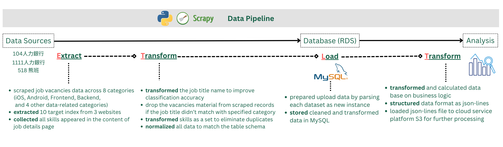

  - **Data Sources**: The data is sourced from job postings on 104人力銀行, 1111人力銀行, and 518熊班.

  - **Scraping**:
    
    - **Extraction from Multiple Websites**: Data is extracted from job postings on three distinct websites, namely 104人力銀行, 1111人力銀行, and 518熊班. Each website presented its unique structure, and the scraping process was adapted to accommodate these differences.

    - **Concurrency for Improved Speed**: Three spiders and multiple pipelines were concurrently created to significantly improve the speed of the scraping process, overcoming the default single-threaded nature of this framework.

    - **Target Indices to Scrape**: The data collection process focuses on collecting specific target indices, including job title, location, salary, employing company, required skills, education, and experience criteria.

    - **Collecting All Skills Mentioned in Job Details**: The scraping process involved not only extracting job details but also identifying and collecting all the skills mentioned within the content of job descriptions. This comprehensive skill collection enriches the dataset and facilitates analysis.

  - **Cleaning**:

    The data cleaning process is crucial for ensuring data quality and consistency. This step focuses on cleaning and normalizing various data types, including:

    - **Job Title Categorized**: This step ensures that job titles are not only consistent but also categorized properly. Job titles are checked to verify if they match the defined category scope. If a job title doesn't include the specific keywords associated with its category, the scraped item is immediately dropped, preventing further processing for that item. This stringent categorization process ensures that only relevant job listings are included in the dataset, maintaining data quality and relevance.
  
    - **Salary Normalization**: Transformed salary information from job listings, allowing for easy analysis and comparison. It takes into account various salary formats, including ranges, monthly rates, and yearly rates, and handles special cases where salary values are expressed in a non-standard way. The result is a normalized representation of salary information for further processing and storage.
  
    - **Experience Normalization**: Ensuring that experience requirements are standardized and extracting relevant numerical values.
  
    - **Location Normalization**: Formatting location data consistently.
  
    - **Education Normalization**: Mapping education level requirements to standardized values, or setting them to None if not predefined.
    
  - **Storage**:

    After performing the necessary data transformations and handling, this step constructs a tuple of item data for insertion into the database.
    
    - **S3**: The S3 bucket stores the raw scraped data for backup and future purposes. It serves as a data lake for long-term storage.
  
    - **MySQL**: The primary storage method which houses the cleaned and normalized data. The database stores structured information, also making it easily accessible for analysis and reporting.

_[Top](#table-of-contents)_

### Database/Storage
- MySQL Schema
  
    | Field | Data Type | Description | 
    | :---: | :---: | :--- |
    | id | Number | Job id. |
    | category | String | Job category. |
    | job_title | String | Job title. |
    | location | String | Job location. |
    | company | String | Employer (hiring company) of the job.  |
    | min_monthly_salary | String | Minimum monthly salary. |
    | max_monthly_salary | String | Maximum monthly salary. |
    | education | String | Required academic qualifications of the job. |
    | skills | String | Required skills of the job. |
    | experience | String | Required working experiences of the job. |
    | job_link | String | Source website link of the job. |
    | source_website | String | Source website name. |

- S3 Schema
  - Format: json lines

_[Top](#table-of-contents)_

### Visualization
To facilitate visual exploration and analysis of various aspects of the job listings data, a set of interactive charts has been created using Plotly in JavaScript. These charts provide valuable insights into the dataset and enhance data visualization.

For Overall Engineer's Job:
- Ranking of Job Vacancies
  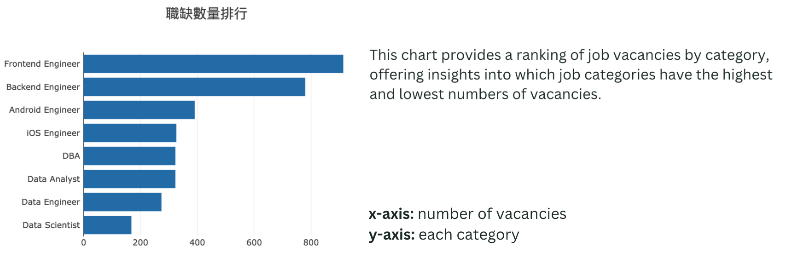

- Percentage of Work Experience
  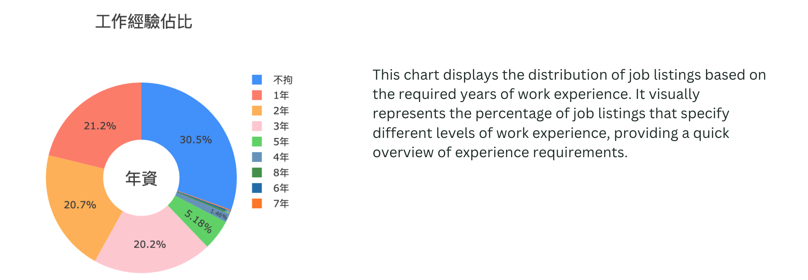

- Average Monthly Income
  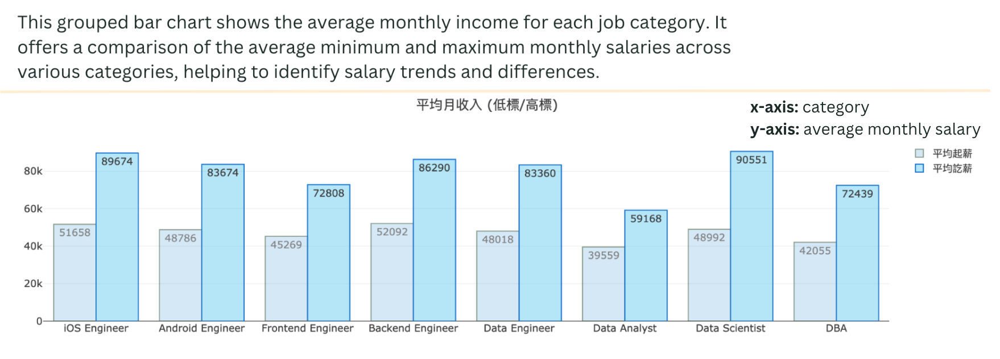
  
For Each Selected Category:
- Percentage of Educational Background
  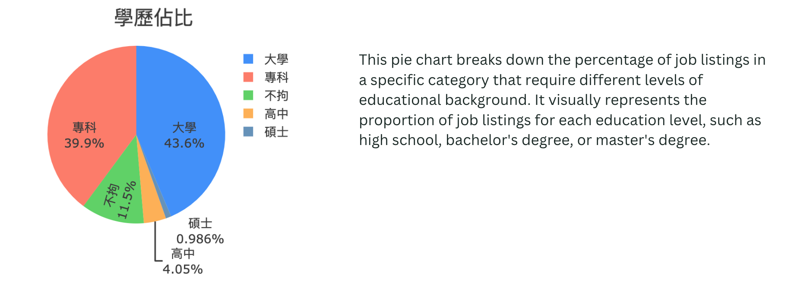

- Relevant Skill Requirements
  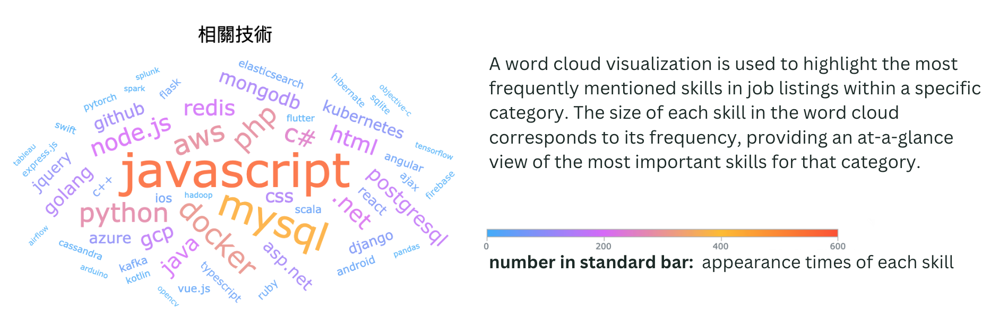

- Ranking of Skills
  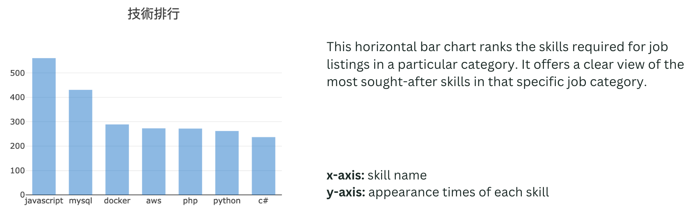

- Monthly Income Distribution
  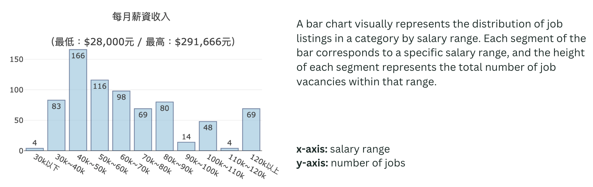

_[Top](#table-of-contents)_

### Scheduling
Linked ScrapeOps through an API connection to schedule the Scrapy job, ensuring the data pipeline initiates the web scraping process __once a day__. This integration allows the Scrapy module to be configured for regular data collection from the source website at defined intervals.

<video src="views/image/scrapeOpsSchedule.mp4" controls autoplay loop></video>

_[Top](#table-of-contents)_
  
### Monitoring
- **PM2 - Server Monitor**
  
  Real-Time demo of Node.js server
  <video src="views/image/serverMonit.mp4" controls autoplay loop></video>

- **ScrapyOps - Data Pipeline Monitor**

  <video src="views/image/scrapeOpsMonit.mp4" controls autoplay loop></video>

_[Top](#table-of-contents)_

### CI/CD
Implemented a CI/CD pipeline to enhance the development workflow. This automated process deploys the code to an Amazon EC2 server upon successful tests, ensuring the continuous and uninterrupted operation of the website following code changes.

<video src="views/image/cicd.mp4" controls autoplay loop></video>

- Tools: GitHub Action
- Node Version: 14
  
- **CI** (Continuous Integration)
  - Triggered Condition:
    ```
    on:
      push:
        branches:
          - test
      pull_request:
        branches:
          - main
          - develop
    ```
  - Using Node Package Manager (npm) modules to execute tests with the command `nyc mocha` specified in the package.json file.
  
  - Achieved test coverage of approximately 57% of the function in one file.  

- **CD** (Continuous Deployment)
  - Triggered Condition:
    ```
    deploy:
      needs: test
    ```
  - Used AWS IAM user with the GitHub Action Policy to facilitate connections from GitHub.

  - Installed Node.js to create the environment for executing JavaScript code on the website.
  
  - Performed the shell script code to check PM2 status, ensuring continuous server monitoring.
  
  - Implemented security measures by removing GitHub Actions IP from the security group for connection security.

_[Top](#table-of-contents)_

## Technologies Used

- Programming Languages: Python, JavaScript
- Database: MySQL
- Frameworks: Express
- Web Server: NGINX
- Data Visualization Tool: Plotly
- Environment: Miniconda, Node.js
- Cloud Engineering - AWS: EC2, S3, RDS
- Monitoring Tools: PM2, ScrapeOps
- CI/CD Tools: GitHub Actions

_[Top](#table-of-contents)_

## Contact

:mailbox: lksh20602@gmail.com

[](https://www.linkedin.com/in/rubywu-140031206/)

_[Top](#table-of-contents)_